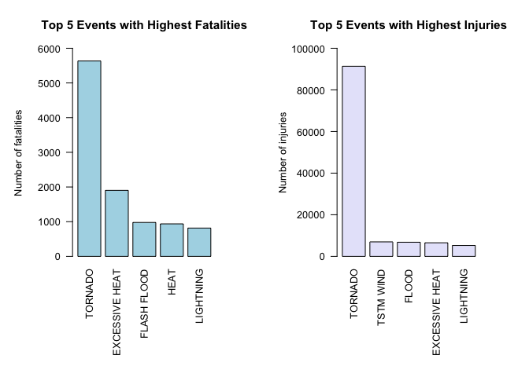
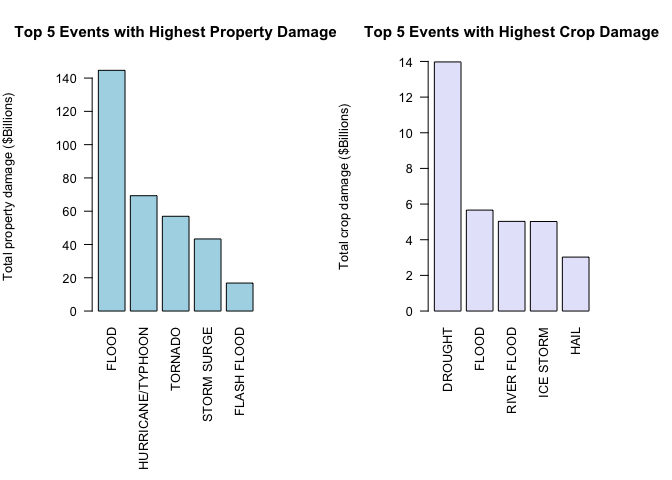

## Synopsis
This project involves exploring the U.S. National Oceanic and Atmospheric Administration's (NOAA) storm database. This database tracks characteristics of major storms and weather events in the United States, including when and where they occur, as well as estimates of any fatalities, injuries, and property damage.

The basic goal of this assignment is to explore the NOAA Storm Database and answer the following questions:

1. Across the United States, which types of events (as indicated in the EVTYPE variable) are most harmful with respect to population health?
2. Across the United States, which types of events have the greatest economic consequences?

## Data 
The data for this assignment comes in the form of a comma-separated-value file compressed via the bzip2 algorithm to reduce its size. You can download the file [here](https://d396qusza40orc.cloudfront.net/repdata%2Fdata%2FStormData.csv.bz2).

There is also some documentation of the database available. Here you will find how some of the variables are constructed/defined.  
[National Weather Service Storm Data Documentation](https://d396qusza40orc.cloudfront.net/repdata%2Fpeer2_doc%2Fpd01016005curr.pdf)
[National Climatic Data Center Storm Events FAQ](https://d396qusza40orc.cloudfront.net/repdata%2Fpeer2_doc%2FNCDC%20Storm%20Events-FAQ%20Page.pdf)  

The events in the database start in the year 1950 and end in November 2011. In the earlier years of the database there are generally fewer events recorded, most likely due to a lack of good records. More recent years should be considered more complete.  

## Data Processing

```r
#Load packages
library(dplyr)
```

```
## 
## Attaching package: 'dplyr'
```

```
## The following objects are masked from 'package:stats':
## 
##     filter, lag
```

```
## The following objects are masked from 'package:base':
## 
##     intersect, setdiff, setequal, union
```

```r
library(ggplot2)

# Download and unzip file if it does not exist
URL <- "http://d396qusza40orc.cloudfront.net/repdata%2Fdata%2FStormData.csv.bz2"
filename <- "repdata_data_StormData.csv"

if (!file.exists(filename)) {
  download.file(URL, filename, method = "curl")
}

# Read data
data <- read.csv(bzfile(filename), header = TRUE)

# Keep only relevant columns for analysis of health and economic impact
data <- data[, c("EVTYPE", "FATALITIES", "INJURIES", "PROPDMG", "PROPDMGEXP", "CROPDMG", 
           "CROPDMGEXP")]

# Convert all event strings to uppercase (to remove duplicate events)
data <- mutate_at(data, "EVTYPE", toupper)
```

## Results 

### Across the United States, which types of event are most harmful with respect to population health?

First, calculate the total fatalities and injuries per event 

```r
options(scipen=999)

# Calculate total fatalities per event
fatalities <- data %>% 
  group_by(EVTYPE) %>%
  summarize(sum(FATALITIES))
colnames(fatalities) = c("event", "fatalities")

# Order and subset only to top 5 events
fatalities <- fatalities[order(fatalities$fatalities, decreasing = TRUE), ]
fatal5 <- fatalities[1:5, ]

# Calculate total injuries per event
injuries <- data %>% 
  group_by(EVTYPE) %>%
  summarize(sum(INJURIES))
colnames(injuries) = c("event", "injuries")

# Order and subset only to top 5 events
injuries <- injuries[order(injuries$injuries, decreasing = TRUE), ]
injuries5 <-injuries[1:5, ]
```

Create plot of the 5 most harmful events

```r
par(mfrow = c(1,2), mar = c(10, 6, 4, 4), mgp = c(4, 1, 0), cex = 0.8)
barplot(fatal5$fatalities, 
        names.arg = fatal5$event, 
        main = "Top 5 Events with Highest Fatalities",
        ylab = "Number of fatalities",
        ylim = range(pretty(c(0, fatal5$fatalities))),
        las = 2,
        col = "light blue"
        )
barplot(injuries5$injuries, 
        names.arg = injuries5$event, 
        main = "Top 5 Events with Highest Injuries",
        ylab = "Number of injuries",
        ylim = range(pretty(c(0, injuries5$injuries))),
        las = 2,
        col = "lavender"
        )
```

<!-- -->

As shown in the graph above, tornado, excessive heat, flash flood, heat, lightning are the most harmful in terms of fatalities. Meanwhile, tornado, tstm wind, flood, excessive heat, lightning are the most harmful in terms of injuries. Across both fatalities and injuries, tornadoes are the most harmful. 

### Across the United States, which types of events have the greatest economic consequences?

First, let's examine the economic data

```r
unique(data$PROPDMGEXP)
```

```
##  [1] K M   B m + 0 5 6 ? 4 2 3 h 7 H - 1 8
## Levels:  - ? + 0 1 2 3 4 5 6 7 8 B h H K m M
```

```r
unique(data$CROPDMGEXP)
```

```
## [1]   M K m B ? 0 k 2
## Levels:  ? 0 2 B k K m M
```

Do some cleaning of the economic data

```r
# Change all to uppercase letters
data <- mutate_at(data, "PROPDMGEXP", toupper)
data <- mutate_at(data, "CROPDMGEXP", toupper)

# Replace symbols with 0 
data$PROPDMGEXP[data$PROPDMGEXP %in% c("", "+", "-", "?")] = "0"
data$CROPDMGEXP[data$CROPDMGEXP %in% c("", "+", "-", "?")] = "0"

# Convert letters to numeric exponents
data$PROPDMGEXP[data$PROPDMGEXP %in% "B"] = "9"
data$PROPDMGEXP[data$PROPDMGEXP %in% "M"] = "6"
data$PROPDMGEXP[data$PROPDMGEXP %in% "K"] = "3"
data$PROPDMGEXP[data$PROPDMGEXP %in% "H"] = "2"
data$PROPDMGEXP <- 10^(as.numeric(data$PROPDMGEXP)) 

data$CROPDMGEXP[data$CROPDMGEXP %in% "B"] = "9"
data$CROPDMGEXP[data$CROPDMGEXP %in% "M"] = "6"
data$CROPDMGEXP[data$CROPDMGEXP %in% "K"] = "3"
data$CROPDMGEXP[data$CROPDMGEXP %in% "H"] = "2"
data$CROPDMGEXP <- 10^(as.numeric(data$CROPDMGEXP)) 

# Multiply damage by corresponding exponent and add to new columns 
data$TOTAL.PROPDMG <- data$PROPDMG * data$PROPDMGEXP
data$TOTAL.CROPDMG <- data$CROPDMG * data$CROPDMGEXP
```

Next, calculate total property damage and total crop damage per event

```r
# Calculate total property damage per event
totalpropdmg <- data %>% 
  group_by(EVTYPE) %>%
  summarize(sum(TOTAL.PROPDMG))
colnames(totalpropdmg) = c("event", "propdmg")
totalpropdmg$propdmg <- totalpropdmg$propdmg / 10^9 #Scale to billions


# Order and subset only to top 5 events
totalpropdmg <- totalpropdmg[order(totalpropdmg$propdmg, decreasing = TRUE), ]
prop5 <- totalpropdmg[1:5, ]

# Calculate total crop damage per event
totalcropdmg <- data %>% 
  group_by(EVTYPE) %>%
  summarize(sum(TOTAL.CROPDMG))
colnames(totalcropdmg) = c("event", "cropdmg")
totalcropdmg$cropdmg <- totalcropdmg$cropdmg / 10^9 #Scale to billions

# Order and subset only to top 5 events
totalcropdmg <- totalcropdmg[order(totalcropdmg$cropdmg, decreasing = TRUE), ]
crop5 <- totalcropdmg[1:5, ]
```

Create plot of the 5 most harmful events

```r
par(mfrow = c(1,2), mar = c(11, 6, 4, 5), mgp = c(5, 1, 0), cex = 0.8)
barplot(prop5$propdmg, 
        names.arg = prop5$event, 
        main = "Top 5 Events with Highest Property Damage",
        ylab = "Total property damage ($Billions)",
        ylim = range(pretty(c(0, prop5$propdmg))),
        las = 2,
        col = "light blue"
        )
barplot(crop5$cropdmg, 
        names.arg = crop5$event, 
        main = "Top 5 Events with Highest Crop Damage",
        ylab = "Total crop damage ($Billions)",
        ylim = range(pretty(c(0, crop5$cropdmg))),
        las = 2,
        col = "lavender"
        )
```

<!-- -->

As shown in the graph above, flood, hurricane/typhoon, tornado, storm surge, flash flood have the greatest economic consequences in terms of property damage. Meanwhile, drought, flood, river flood, ice storm, hail have the greatest economic consequences in terms of crop damage.
