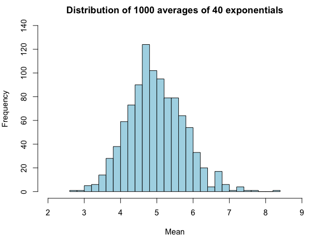
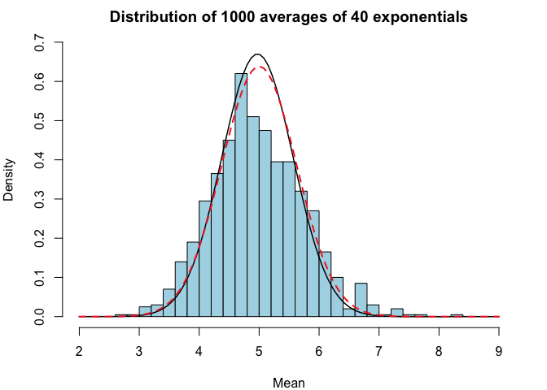

# Statistical Inference Course Project Part 1

## Overview

This project investigates the exponential distribution and compares it with the Central Limit Theorem. The exponential distribution can be simulated in R with rexp(n, lambda) where lambda is the rate parameter. The mean of exponential distribution is 1/lambda and the standard deviation is also 1/lambda. 

### Instructions 

* Set lambda = 0.2 for all of the simulations. 
* Investigate the distribution of averages of 40 exponentials. 
* Run a thousand simulations.

Illustrate via simulation and associated explanatory text the properties of the distribution of the mean of 40 exponentials.
1. Show the sample mean and compare it to the theoretical mean of the distribution.
2. Show how variable the sample is (via variance) and compare it to the theoretical variance of the distribution.
3. Show that the distribution is approximately normal.

In point 3, focus on the difference between the distribution of a large collection of random exponentials and the distribution of a large collection of averages of 40 exponentials.

## Simulations

```r
set.seed(12345)

# Set parameters
lambda <- 0.2 # lambda
n <- 40 # Number of exponentials
nsims <- 1000 # Number of simulations

# Simulate the mean of 40 exponentials and replicate this 1000 times
sim <- replicate(nsims, mean(rexp(n, lambda))) 
```

Let's take a look at the distribution of the mean of 40 exponentials. 

```r
par(mar = c(4, 4, 2, 2))
hist(sim, 
     breaks = 40,
     xlim = range(2, 9),
     ylim = range(0, 140),
     col = "light blue",
     main = "Distribution of 1000 averages of 40 exponentials",
     xlab = "Mean"
     )
```

<!-- -->

## Sample Mean versus Theoretical Mean

Next, we obtain the mean of the distribution above (sample mean) and compare it to the theoretical mean. 

```r
theoretical.mean <- 1/lambda
sample.mean <- mean(sim)
cbind(theoretical.mean, sample.mean)
```

```
##      theoretical.mean sample.mean
## [1,]                5    4.971972
```
As shown above, the sample mean is similar to the theoretical mean. 

## Sample Variance versus Theoretical Variance

Now, we obtain the variance of the distribution above (sample variance) and compare it to the theoretical variance.

```r
theoretical.variance <- ((1/lambda)/sqrt(n))^2
sample.variance <- var(sim)
cbind(theoretical.variance, sample.variance)
```

```
##      theoretical.variance sample.variance
## [1,]                0.625       0.5954369
```
The sample variance is also fairly close to the theoretical variance. 

## Distribution

Finally, we show that the distribution of the averages is approximately normal. 

```r
# Plot density distribution
par(mar = c(4, 4, 2, 2))
hist(sim, 
     probability = TRUE,
     breaks = 40,
     xlim = range(2, 9),
     ylim = range(0.0, 0.7),
     col = "light blue",
     main = "Distribution of 1000 averages of 40 exponentials",
     xlab = "Mean"
     )
# Add sample normal curve 
curve(dnorm(x, 
            mean = sample.mean, 
            sd = sample.variance), 
      col = "black", 
      lwd = 1.5, 
      add = TRUE, 
      )
# Add theoretical normal curve
curve(dnorm(x, 
            mean = theoretical.mean, 
            sd = theoretical.variance), 
      col = "firebrick2", 
      lwd = 2,
      lty = 2,
      add = TRUE, 
      )
```

<!-- -->

The black solid line plots the normal curve based on our sample distribution, while the dashed red line plots the true normal curve. As illustrated in the chart above, our sample distribution is approximately normal. 
