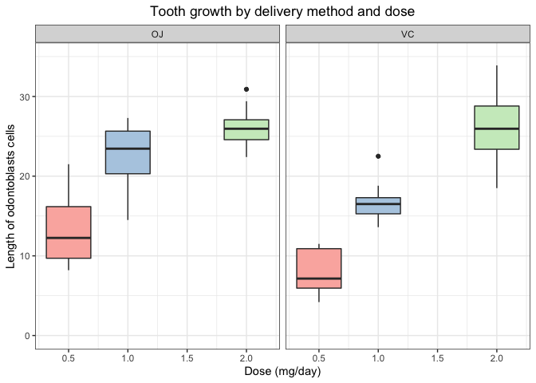

# Statistical Inference Course Project Part 2

## Overview
In the second part of this project, we're going to analyze the ToothGrowth data in the R datasets package.

### Instructions 
1. Load the ToothGrowth data and perform some basic exploratory data analyses
2. Provide a basic summary of the data.
3. Use confidence intervals and/or hypothesis tests to compare tooth growth by supp and dose, using only techniques from class.
4. State your conclusions and the assumptions needed for your conclusions.

## Exploratory Data Analyses

First, load the data and examine its structure

```r
# Load required packages
library(ggplot2)

# Load data
data("ToothGrowth")

# Examine structure
str(ToothGrowth)
```

```
## 'data.frame':	60 obs. of  3 variables:
##  $ len : num  4.2 11.5 7.3 5.8 6.4 10 11.2 11.2 5.2 7 ...
##  $ supp: Factor w/ 2 levels "OJ","VC": 2 2 2 2 2 2 2 2 2 2 ...
##  $ dose: num  0.5 0.5 0.5 0.5 0.5 0.5 0.5 0.5 0.5 0.5 ...
```

Next, let's do a basic summary of the data

```r
summary(ToothGrowth)
```

```
##       len        supp         dose      
##  Min.   : 4.20   OJ:30   Min.   :0.500  
##  1st Qu.:13.07   VC:30   1st Qu.:0.500  
##  Median :19.25           Median :1.000  
##  Mean   :18.81           Mean   :1.167  
##  3rd Qu.:25.27           3rd Qu.:2.000  
##  Max.   :33.90           Max.   :2.000
```

Let's plot the summary of tooth growth by delivery method and dose

```r
ggplot(ToothGrowth, aes(x = dose, y = len)) + 
  geom_boxplot(aes(fill = factor(dose)), show.legend = FALSE) +
  facet_grid(. ~ supp) +
  labs(x = "Dose (mg/day)", 
       y = "Length of odontoblasts cells", 
       title = "Tooth growth by delivery method and dose"
       ) +
  ylim(range(pretty(c(0, ToothGrowth$len)))) + 
  theme_bw() + 
  scale_fill_brewer(palette="Pastel1") +
  theme(plot.title = element_text(hjust = 0.5))
```

<!-- -->

## Hypothesis Testing

### Does Vitamin C delivery method affect tooth growth? 

The first hypothesis we will test is as follows: 
$H_0$: The Vitamin C delivery method (orange juice vs ascorbic acid) does not affect tooth growth (i.e. The difference in means between both methods equals 0).
$H_1$: The Vitamin C delivery method (orange juice vs ascorbic acid) affects tooth growth. (i.e. The difference in means between both methods does not equal 0).

Run t-test

```r
t.test(len~supp, data = ToothGrowth)
```

```
## 
## 	Welch Two Sample t-test
## 
## data:  len by supp
## t = 1.9153, df = 55.309, p-value = 0.06063
## alternative hypothesis: true difference in means is not equal to 0
## 95 percent confidence interval:
##  -0.1710156  7.5710156
## sample estimates:
## mean in group OJ mean in group VC 
##         20.66333         16.96333
```
Given that the p-value is about 0.06 and the confidence interval (CI) contains 0, we fail to reject the null hypothesis. The delivery method of Vitamin C does not seem to affect tooth growth.

### Does Vitamin C dosing affect tooth growth?

The next hypothesis we will test is as follows: 
$H_0$: The Vitamin C dose does not affect tooth growth (i.e. The difference in means between doses equals 0).
$H_1$: The Vitamin C dose affects tooth growth (i.e. The difference in means between doses does not equal 0).

Because there are 3 different doses, we will run 2 t-tests. 

```r
options(scipen = 999)

# Run t-test for doses 0.5 mg/day vs 1.0 mg/day
dose.subset1 <- subset(ToothGrowth, ToothGrowth$dose %in% c(0.5, 1.0))
ttest1 <- t.test(len~dose, data = dose.subset1)
ttest1
```

```
## 
## 	Welch Two Sample t-test
## 
## data:  len by dose
## t = -6.4766, df = 37.986, p-value = 0.0000001268
## alternative hypothesis: true difference in means is not equal to 0
## 95 percent confidence interval:
##  -11.983781  -6.276219
## sample estimates:
## mean in group 0.5   mean in group 1 
##            10.605            19.735
```


```r
# Run t-test for doses 1.0 mg/day vs 2.0 mg/day
dose.subset2 <- subset(ToothGrowth, ToothGrowth$dose %in% c(1.0, 2.0))
ttest2 <- t.test(len~dose, data = dose.subset2)
ttest2
```

```
## 
## 	Welch Two Sample t-test
## 
## data:  len by dose
## t = -4.9005, df = 37.101, p-value = 0.00001906
## alternative hypothesis: true difference in means is not equal to 0
## 95 percent confidence interval:
##  -8.996481 -3.733519
## sample estimates:
## mean in group 1 mean in group 2 
##          19.735          26.100
```

The p-values for both tests are much smaller than 0.05, and all CIs do not overlap with 0, suggesting that Vitamin C dose has an impact on tooth growth. 

However, since we did multiple comparisons, let's do a Bonferroni correction to see if our results still hold. 

```r
# Store all p-values in a vector
pvals <- c(ttest1$p.value, ttest2$p.value)

# Do Bonferroni correction
adjusted.pvals <- p.adjust(pvals, method = "bonferroni")

# Calculate number of significant p-values
sum(adjusted.pvals < 0.05)
```

```
## [1] 2
```

After Bonferroni correction, both p-values are still significant. So, our results still hold. 

## Conclusions

Assuming that (1) the ToothGrowth data sample is representative of the population, and (2) the distribution of the sample means is approximately normal, we can conclude the following: 
1. Delivery method of Vitamin C does not have an impact on tooth growth. 
2. Vitamin C dose does affect tooth growth. Specifically, the higher the dose, the larger the tooth growth.   
