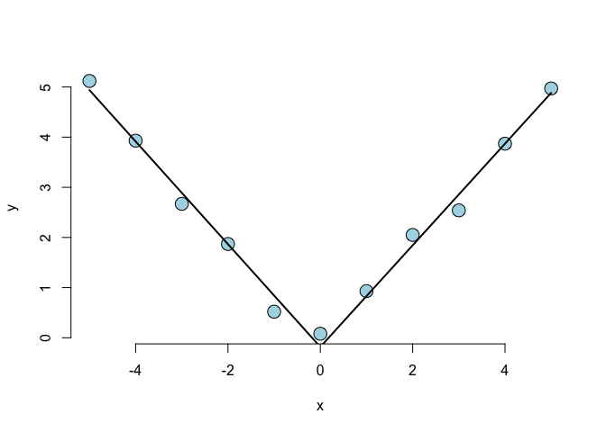

# Regression Models Quiz 4 

Q1. Consider the space shuttle data 'shuttle' in the 'MASS' library. Consider modeling the use of the autolander as the outcome (variable name 'use'). Fit a logistic regression model with autolander (variable auto) use (labeled as 'auto' 1) versus not (0) as predicted by wind sign (variable 'wind'). Give the estimated odds ratio for autolander use comparing head winds, labeled as "head" in the variable headwind (numerator) to tail winds (denominator).

```r
library(MASS)
data(shuttle)
str(shuttle)
```

```
## 'data.frame':	256 obs. of  7 variables:
##  $ stability: Factor w/ 2 levels "stab","xstab": 2 2 2 2 2 2 2 2 2 2 ...
##  $ error    : Factor w/ 4 levels "LX","MM","SS",..: 1 1 1 1 1 1 1 1 1 1 ...
##  $ sign     : Factor w/ 2 levels "nn","pp": 2 2 2 2 2 2 1 1 1 1 ...
##  $ wind     : Factor w/ 2 levels "head","tail": 1 1 1 2 2 2 1 1 1 2 ...
##  $ magn     : Factor w/ 4 levels "Light","Medium",..: 1 2 4 1 2 4 1 2 4 1 ...
##  $ vis      : Factor w/ 2 levels "no","yes": 1 1 1 1 1 1 1 1 1 1 ...
##  $ use      : Factor w/ 2 levels "auto","noauto": 1 1 1 1 1 1 1 1 1 1 ...
```

```r
# Fit logistic regression
fit <- glm(factor(use) ~ factor(wind), family = "binomial", data = shuttle)

# Get odds ratio
exp(coef(fit))
```

```
##      (Intercept) factor(wind)tail 
##        0.7777778        0.9686888
```

Q2. Consider the previous problem. Give the estimated odds ratio for autolander use comparing head winds (numerator) to tail winds (denominator) adjusting for wind strength from the variable magn.


```r
# Fit logistic regression
fit2 <- glm(factor(use) ~ factor(wind) + factor(magn), family = "binomial", data = shuttle)

# Get odds ratio
exp(coef(fit2))
```

```
##        (Intercept)   factor(wind)tail factor(magn)Medium 
##          0.6952323          0.9684981          1.0000000 
##    factor(magn)Out factor(magn)Strong 
##          1.4615736          1.0665323
```

Q3. If you fit a logistic regression model to a binary variable, for example use of the autolander, then fit a logistic regression model for one minus the outcome (not using the autolander) what happens to the coefficients?


```r
# Convert use to binary variable
shuttle$use <- as.numeric(shuttle$use == "auto")

# Fit logistic regression with inverse of using outlander
fit3 <- glm(I(1 - use) ~ factor(wind), family = "binomial", data = shuttle)

# Compare with original fit
rbind(coef(fit), coef(fit3))
```

```
##      (Intercept) factor(wind)tail
## [1,]  -0.2513144      -0.03181183
## [2,]  -0.2513144      -0.03181183
```
Answer:The coefficients reverse their signs.

Q4. Consider the insect spray data 'InsectSprays'. Fit a Poisson model using spray as a factor level. Report the estimated relative rate comapring spray A (numerator) to spray B (denominator).

```r
# Load data
data("InsectSprays")

# Fit model
fit4 <- glm(count ~ factor(spray), family = "poisson", data = InsectSprays)
fit4coefs <- summary(fit4)$coef
fit4coefs
```

```
##                   Estimate Std. Error    z value      Pr(>|z|)
## (Intercept)     2.67414865  0.0758098 35.2744434 1.448048e-272
## factor(spray)B  0.05588046  0.1057445  0.5284477  5.971887e-01
## factor(spray)C -1.94017947  0.2138857 -9.0711059  1.178151e-19
## factor(spray)D -1.08151786  0.1506528 -7.1788745  7.028761e-13
## factor(spray)E -1.42138568  0.1719205 -8.2676928  1.365763e-16
## factor(spray)F  0.13926207  0.1036683  1.3433422  1.791612e-01
```


```r
# Calculate relative rate
exp(fit4coefs[1, 1]) / exp(fit4coefs[1, 1] + fit4coefs[2, 1]) 
```

```
## [1] 0.9456522
```

Q5. Consider a Poisson glm with an offset, $t$. So, for example, a model of the form $glm(count x + offset(t), family = poisson)$ where $x$ is a factor variable comparing a treatment (1) to a control (0) and $t$ is the natural log of a monitoring time. What is the impact of the coefficient for $x$  if we fit the model $glm(count x + offset(t2), family = poisson)$ where $2 <- log(10) + t$? In other words, what happens to the coefficients if we change the units of the offset variable. (Note, adding log(10) on the log scale is multiplying by 10 on the original scale.)

```r
fit5 <- glm(count ~ factor(spray), offset = log(count + 1), family = "poisson", data = InsectSprays)
summary(fit5)$coef
```

```
##                    Estimate Std. Error     z value  Pr(>|z|)
## (Intercept)    -0.066691374  0.0758098 -0.87971965 0.3790112
## factor(spray)B  0.003512473  0.1057445  0.03321659 0.9735019
## factor(spray)C -0.325350713  0.2138857 -1.52114274 0.1282240
## factor(spray)D -0.118451059  0.1506528 -0.78625173 0.4317200
## factor(spray)E -0.184623054  0.1719205 -1.07388635 0.2828736
## factor(spray)F  0.008422466  0.1036683  0.08124434 0.9352476
```

```r
fit6 <- glm(count ~ factor(spray), offset = log(10) + log(count + 1), family = "poisson", data = InsectSprays)
summary(fit6)$coef
```

```
##                    Estimate Std. Error      z value      Pr(>|z|)
## (Intercept)    -2.369276467  0.0758098 -31.25290307 2.038695e-214
## factor(spray)B  0.003512473  0.1057445   0.03321659  9.735019e-01
## factor(spray)C -0.325350713  0.2138857  -1.52114274  1.282240e-01
## factor(spray)D -0.118451059  0.1506528  -0.78625173  4.317200e-01
## factor(spray)E -0.184623054  0.1719205  -1.07388635  2.828736e-01
## factor(spray)F  0.008422466  0.1036683   0.08124434  9.352476e-01
```
Answer: The coefficient estimate is unchanged. 

Q6. Consider the data

```r
x <- -5:5
y <- c(5.12, 3.93, 2.67, 1.87, 0.52, 0.08, 0.93, 2.05, 2.54, 3.87, 4.97)
```

Using a knot point at 0, fit a linear model that looks like a hockey stick with two lines meeting at x = 0. Include an intercept term, x and the knot point term. What is the estimated slope of the line after 0?

```r
knots <- 0 
splineTerms <- sapply(knots, function(knot) (x > knot) * (x - knot))
xMat <- cbind(1, x, splineTerms)
yhat <- predict(lm(y ~ xMat - 1))
plot(x, y, frame = FALSE, pch = 21, bg = "lightblue", cex = 2)
lines(x, yhat, col = "black", lwd = 2)
```

<!-- -->

```r
fit7 <- lm(y ~ xMat + -1)
summary(fit7)
```

```
## 
## Call:
## lm(formula = y ~ xMat + -1)
## 
## Residuals:
##      Min       1Q   Median       3Q      Max 
## -0.32158 -0.10979  0.01595  0.14065  0.26258 
## 
## Coefficients:
##       Estimate Std. Error t value Pr(>|t|)    
## xMat  -0.18258    0.13558  -1.347    0.215    
## xMatx -1.02416    0.04805 -21.313 2.47e-08 ***
## xMat   2.03723    0.08575  23.759 1.05e-08 ***
## ---
## Signif. codes:  0 '***' 0.001 '**' 0.01 '*' 0.05 '.' 0.1 ' ' 1
## 
## Residual standard error: 0.2276 on 8 degrees of freedom
## Multiple R-squared:  0.996,	Adjusted R-squared:  0.9945 
## F-statistic:   665 on 3 and 8 DF,  p-value: 6.253e-10
```

```r
sum(fit7$coef[2:3])
```

```
## [1] 1.013067
```

