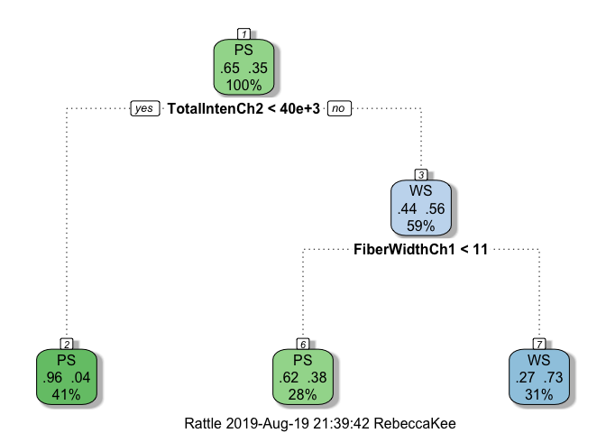

# Practical Machine Learning Quiz 3 

Q1. Load the cell segmentation data from the AppliedPredictiveModeling package using the commands:

```r
library(AppliedPredictiveModeling)
data(segmentationOriginal)
library(caret)
```

```
## Loading required package: lattice
```

```
## Loading required package: ggplot2
```

1. Subset the data to a training set and testing set based on the Case variable in the data set.

2. Set the seed to 125 and fit a CART model with the rpart method using all predictor variables and default caret settings.

3. In the final model what would be the final model prediction for cases with the following variable values:

a. TotalIntench2 = 23,000; FiberWidthCh1 = 10; PerimStatusCh1=2

b. TotalIntench2 = 50,000; FiberWidthCh1 = 10;VarIntenCh4 = 100

c. TotalIntench2 = 57,000; FiberWidthCh1 = 8;VarIntenCh4 = 100

d. FiberWidthCh1 = 8;VarIntenCh4 = 100; PerimStatusCh1=2

```r
# Subset to training and testing set
partition <- createDataPartition(y = segmentationOriginal$Case, p = 0.8, list = FALSE)
training <- segmentationOriginal[partition, ]
testing <- segmentationOriginal[-partition, ]

# Set seed and fit model
set.seed(125, sample.kind = "Rounding")
```

```
## Warning in set.seed(125, sample.kind = "Rounding"): non-uniform 'Rounding'
## sampler used
```

```r
fit <- train(Class ~ ., method = "rpart", data = training)

# Plot model
library(rattle)
```

```
## Rattle: A free graphical interface for data science with R.
## Version 5.2.0 Copyright (c) 2006-2018 Togaware Pty Ltd.
## Type 'rattle()' to shake, rattle, and roll your data.
```

```r
fancyRpartPlot(fit$finalModel)
```

<!-- -->
Answer: 
a. PS

b. WS

c. PS

d. Not possible to predict

Q2. If K is small in a K-fold cross validation is the bias in the estimate of out-of-sample (test set) accuracy smaller or bigger? If K is small is the variance in the estimate of out-of-sample (test set) accuracy smaller or bigger. Is K large or small in leave one out cross validation?

Answer: The bias is larger and the variance is smaller. Under leave one out cross validation K is equal to the sample size.

Q3. Load the olive oil data using the commands:

```r
library(pgmm)
data(olive)
olive = olive[,-1]
```

These data contain information on 572 different Italian olive oils from multiple regions in Italy. Fit a classification tree where Area is the outcome variable. Then predict the value of area for the following data frame using the tree command with all defaults.

```r
newdata = as.data.frame(t(colMeans(olive)))
```

What is the resulting prediction? Is the resulting prediction strange? Why or why not?

```r
# Check out the data
str(olive)
```

```
## 'data.frame':	572 obs. of  9 variables:
##  $ Area       : num  1 1 1 1 1 1 1 1 1 1 ...
##  $ Palmitic   : num  1075 1088 911 966 1051 ...
##  $ Palmitoleic: num  75 73 54 57 67 49 66 61 60 55 ...
##  $ Stearic    : num  226 224 246 240 259 268 264 235 239 213 ...
##  $ Oleic      : num  7823 7709 8113 7952 7771 ...
##  $ Linoleic   : num  672 781 549 619 672 678 618 734 709 633 ...
##  $ Linolenic  : num  36 31 31 50 50 51 49 39 46 26 ...
##  $ Arachidic  : num  60 61 63 78 80 70 56 64 83 52 ...
##  $ Eicosenoic : num  29 29 29 35 46 44 29 35 33 30 ...
```

```r
# Fit model 
olive.fit <- train(Area ~ ., method = "rpart", data = olive)
```

```
## Warning in nominalTrainWorkflow(x = x, y = y, wts = weights, info =
## trainInfo, : There were missing values in resampled performance measures.
```

```r
# Predict value of area
predict(olive.fit, newdata = newdata)
```

```
##        1 
## 2.783282
```
Answer: 2.783. It is strange because Area should be a qualitative variable - but tree is reporting the average value of Area as a numeric variable in the leaf predicted for newdata.

Q4. Load the South Africa Heart Disease Data and create training and test sets with the following code:

```r
library(ElemStatLearn)
data(SAheart)
set.seed(8484, sample.kind = "Rounding")
```

```
## Warning in set.seed(8484, sample.kind = "Rounding"): non-uniform 'Rounding'
## sampler used
```

```r
train = sample(1:dim(SAheart)[1],size=dim(SAheart)[1]/2,replace=F)
trainSA = SAheart[train,]
testSA = SAheart[-train,]
```

```r
str(SAheart)
```

```
## 'data.frame':	462 obs. of  10 variables:
##  $ sbp      : int  160 144 118 170 134 132 142 114 114 132 ...
##  $ tobacco  : num  12 0.01 0.08 7.5 13.6 6.2 4.05 4.08 0 0 ...
##  $ ldl      : num  5.73 4.41 3.48 6.41 3.5 6.47 3.38 4.59 3.83 5.8 ...
##  $ adiposity: num  23.1 28.6 32.3 38 27.8 ...
##  $ famhist  : Factor w/ 2 levels "Absent","Present": 2 1 2 2 2 2 1 2 2 2 ...
##  $ typea    : int  49 55 52 51 60 62 59 62 49 69 ...
##  $ obesity  : num  25.3 28.9 29.1 32 26 ...
##  $ alcohol  : num  97.2 2.06 3.81 24.26 57.34 ...
##  $ age      : int  52 63 46 58 49 45 38 58 29 53 ...
##  $ chd      : int  1 1 0 1 1 0 0 1 0 1 ...
```

Then set the seed to 13234 and fit a logistic regression model (method="glm", be sure to specify family="binomial") with Coronary Heart Disease (chd) as the outcome and age at onset, current alcohol consumption, obesity levels, cumulative tabacco, type-A behavior, and low density lipoprotein cholesterol as predictors. Calculate the misclassification rate for your model using this function and a prediction on the "response" scale:

```r
missClass = function(values,prediction){sum(((prediction > 0.5)*1) != values)/length(values)}
```

What is the misclassification rate on the training set? What is the misclassification rate on the test set?

```r
# Set seed and fit model
set.seed(13234, sample.kind = "Rounding")
```

```
## Warning in set.seed(13234, sample.kind = "Rounding"): non-uniform
## 'Rounding' sampler used
```

```r
SAheart.fit <- train(chd ~ age + alcohol + obesity + tobacco + typea + ldl, 
                     method = "glm",
                     family = "binomial",
                     data = trainSA)
```

```
## Warning in train.default(x, y, weights = w, ...): You are trying to do
## regression and your outcome only has two possible values Are you trying to
## do classification? If so, use a 2 level factor as your outcome column.
```

```r
# Calculate misclassification rate for training and test set
missClass(trainSA$chd, predict(SAheart.fit, newdata = trainSA)) # Training set
```

```
## [1] 0.2727273
```

```r
missClass(testSA$chd, predict(SAheart.fit, newdata = testSA)) # Testing set
```

```
## [1] 0.3116883
```

Q5. Load the vowel.train and vowel.test data sets:

```r
library(ElemStatLearn)
data(vowel.train)
data(vowel.test)
```

Set the variable y to be a factor variable in both the training and test set. Then set the seed to 33833. Fit a random forest predictor relating the factor variable y to the remaining variables. Read about variable importance in random forests here: http://www.stat.berkeley.edu/~breiman/RandomForests/cc_home.htm#ooberr The caret package uses by default the Gini importance.

Calculate the variable importance using the varImp function in the caret package. What is the order of variable importance?


```r
# Create y variable
vowel.train$y <- as.factor(vowel.train$y)
vowel.test$y <- as.factor(vowel.test$y)

set.seed(33833, sample.kind = "Rounding")
```

```
## Warning in set.seed(33833, sample.kind = "Rounding"): non-uniform
## 'Rounding' sampler used
```

```r
# Fit model
vowel.fit <- train(y ~ ., method = "rf", data = vowel.train)

# Calculate variable importance
varImp(vowel.fit)
```

```
## rf variable importance
## 
##      Overall
## x.2  100.000
## x.1   97.511
## x.5   39.196
## x.6   25.532
## x.8   22.663
## x.4    9.684
## x.3    7.975
## x.9    5.655
## x.7    3.589
## x.10   0.000
```

