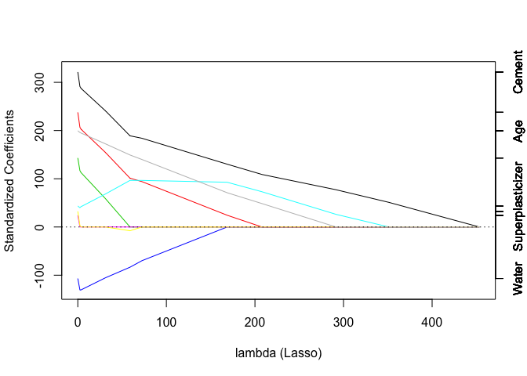

# Practical Machine Learning Quiz 4 

Q1. Load the vowel.train and vowel.test data sets:

```r
library(ElemStatLearn)
library(caret)
```

```
## Loading required package: lattice
```

```
## Loading required package: ggplot2
```

```r
data(vowel.train)
data(vowel.test)
```

Set the variable y to be a factor variable in both the training and test set. Then set the seed to 33833. Fit (1) a random forest predictor relating the factor variable y to the remaining variables and (2) a boosted predictor using the "gbm" method. Fit these both with the train() command in the caret package.

What are the accuracies for the two approaches on the test data set? What is the accuracy among the test set samples where the two methods agree?

```r
# Create y variable
vowel.train$y <- as.factor(vowel.train$y)
vowel.test$y <- as.factor(vowel.test$y)

# Set seed
set.seed(33833, sample.kind = "Rounding")
```

```
## Warning in set.seed(33833, sample.kind = "Rounding"): non-uniform
## 'Rounding' sampler used
```

```r
# Fit random forest predictor
vowel.rf.fit <- train(y ~ ., method = "rf", data = vowel.train)
vowel.gbm.fit <- train(y ~ ., method = "gbm", data = vowel.train)

# Predict with both models
predict.rf <- predict(vowel.rf.fit, vowel.test)
predict.gbm <- predict(vowel.gbm.fit, vowel.test)
```


```r
# Calculate accuracy - rf model
confusionMatrix(predict.rf, vowel.test$y)$overall["Accuracy"]
```

```
##  Accuracy 
## 0.5887446
```


```r
# Calculate accuracy - gbm model
confusionMatrix(predict.gbm, vowel.test$y)$overall["Accuracy"]
```

```
## Accuracy 
## 0.512987
```


```r
# Calculate accuracy - both models
confusionMatrix(predict.rf, predict.gbm)$overall["Accuracy"]
```

```
##  Accuracy 
## 0.6969697
```
Answer (by approximation): 
RF Accuracy = 0.6082
GBM Accuracy = 0.5152
Agreement Accuracy = 0.6361

Q2. Load the Alzheimer's data using the following commands

```r
library(caret)
library(gbm)
```

```
## Loaded gbm 2.1.5
```

```r
set.seed(3433)
library(AppliedPredictiveModeling)
data(AlzheimerDisease)
adData = data.frame(diagnosis,predictors)
inTrain = createDataPartition(adData$diagnosis, p = 3/4)[[1]]
training = adData[ inTrain,]
testing = adData[-inTrain,]
```

Set the seed to 62433 and predict diagnosis with all the other variables using a random forest ("rf"), boosted trees ("gbm") and linear discriminant analysis ("lda") model. Stack the predictions together using random forests ("rf"). What is the resulting accuracy on the test set? Is it better or worse than each of the individual predictions?

```r
set.seed(62433)

# Fit models
alz.rf.fit <- train(diagnosis ~ ., method = "rf", data = training)
alz.gbm.fit <- train(diagnosis ~ ., method = "gbm", data = training)
alz.lda.fit <- train(diagnosis ~ ., method = "lda", data = training)

# Predict
predict.alz.rf <- predict(alz.rf.fit, testing)
predict.alz.gbm <- predict(alz.gbm.fit, testing)
predict.alz.lda <- predict(alz.lda.fit, testing)

# Stack predictions and predict
predict.df <- data.frame(predict.alz.rf, 
                         predict.alz.gbm, 
                         predict.alz.lda, 
                         diagnosis = testing$diagnosis)
alz.stackedfit <- train(diagnosis ~ ., method = "rf", data = predict.df)
predict.stacked <- predict(alz.stackedfit, predict.df)

# Calculate accuracies
accuracy.rf <- confusionMatrix(predict.alz.rf, testing$diagnosis)$overall["Accuracy"]
accuracy.gbm <- confusionMatrix(predict.alz.gbm, testing$diagnosis)$overall["Accuracy"]
accuracy.lda <- confusionMatrix(predict.alz.lda, testing$diagnosis)$overall["Accuracy"]
accuracy.stacked <- confusionMatrix(predict.stacked, testing$diagnosis)$overall["Accuracy"]
```

```r
cbind(accuracy.rf, accuracy.gbm, accuracy.lda, accuracy.stacked)
```

```
##          accuracy.rf accuracy.gbm accuracy.lda accuracy.stacked
## Accuracy   0.7926829    0.7804878    0.7682927         0.804878
```

Answer: Stacked Accuracy: 0.80 is better than all three other methods.

Q3. 

```r
set.seed(3523)
library(AppliedPredictiveModeling)
data(concrete)
inTrain = createDataPartition(concrete$CompressiveStrength, p = 3/4)[[1]]
training = concrete[ inTrain,]
testing = concrete[-inTrain,]
```

Set the seed to 233 and fit a lasso model to predict Compressive Strength. Which variable is the last coefficient to be set to zero as the penalty increases? (Hint: it may be useful to look up ?plot.enet).

```r
library(elasticnet)
```

```
## Loading required package: lars
```

```
## Loaded lars 1.2
```

```r
set.seed(233, sample.kind = "Rounding")
```

```
## Warning in set.seed(233, sample.kind = "Rounding"): non-uniform 'Rounding'
## sampler used
```

```r
# Fit model 
concrete.fit <- train(CompressiveStrength ~ ., method = "lasso", data = training)
plot.enet(concrete.fit$finalModel, xvar = "penalty", use.color = TRUE)
```

<!-- -->
Answer: Cement is the last coefficient to be set to zero. 

Q4. Load the data on the number of visitors to the instructors blog from [here](https://d396qusza40orc.cloudfront.net/predmachlearn/gaData.csv) using the commands:

```r
library(lubridate) # For year() function below
```

```
## 
## Attaching package: 'lubridate'
```

```
## The following object is masked from 'package:base':
## 
##     date
```

```r
dat = read.csv("~/Desktop/gaData.csv")
training = dat[year(dat$date) < 2012,]
testing = dat[(year(dat$date)) > 2011,]
tstrain = ts(training$visitsTumblr)
```

Fit a model using the bats() function in the forecast package to the training time series. Then forecast this model for the remaining time points. For how many of the testing points is the true value within the 95% prediction interval bounds?

```r
library(forecast)
```

```
## Registered S3 method overwritten by 'xts':
##   method     from
##   as.zoo.xts zoo
```

```
## Registered S3 method overwritten by 'quantmod':
##   method            from
##   as.zoo.data.frame zoo
```

```
## Registered S3 methods overwritten by 'forecast':
##   method             from    
##   fitted.fracdiff    fracdiff
##   residuals.fracdiff fracdiff
```

```r
visits.fit <- bats(tstrain)
fcast.visits <- forecast(visits.fit, h = dim(testing)[1], level = 95)
sum(testing$visitsTumblr > fcast.visits$lower & testing$visitsTumblr < fcast.visits$upper) / dim(testing)[1]
```

```
## [1] 0.9617021
```
Answer: About 96% of the testing points have values within the 95% prediction intervals.

Q5. Load the concrete data with the commands:

```r
set.seed(3523, sample.kind = "Rounding")
```

```
## Warning in set.seed(3523, sample.kind = "Rounding"): non-uniform 'Rounding'
## sampler used
```

```r
library(AppliedPredictiveModeling)
data(concrete)
inTrain = createDataPartition(concrete$CompressiveStrength, p = 3/4)[[1]]
training = concrete[ inTrain,]
testing = concrete[-inTrain,]
```

Set the seed to 325 and fit a support vector machine using the e1071 package to predict Compressive Strength using the default settings. Predict on the testing set. What is the RMSE?

```r
set.seed(325)
library(e1071)
concrete.svm <- svm(CompressiveStrength ~ ., data = training)
predict.svm <- predict(concrete.svm, testing)
accuracy(predict.svm, testing$CompressiveStrength)
```

```
##                 ME     RMSE      MAE       MPE     MAPE
## Test set 0.1682863 6.715009 5.120835 -7.102348 19.27739
```


